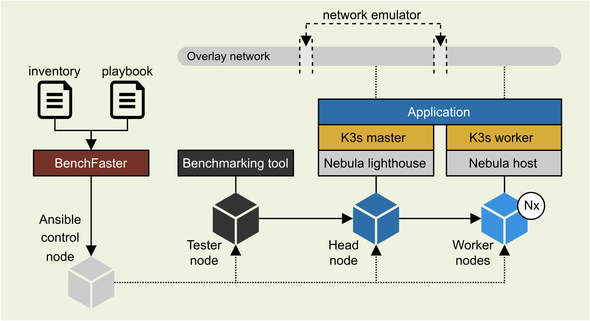

# BenchFaster

BenchFaster automates the deployment and benchmarking of containerized
tools over emulated WANs. 




**Ansible control node**: A system from where one or more instances of BenchFaster are
  launched using Ansible.

**Tester node**: A remote host from where BenchFaster deployment is launched and the
  benchmarks are run.

**Head node**: A remote host where all the core components of BenchFaster are
deployed.

**Worker node**: A remote host where containerized tools are deployed.


### Core components

[](https://docs.ansible.com/)
[](https://k3s.io/)
[](https://github.com/slackhq/nebula)
[](https://man7.org/linux/man-pages/man8/tc-netem.8.html)
[](https://www.vagrantup.com/)

### Supported load testing tools

[](https://jmeter.apache.org/)
[](https://k6.io) 
[](https://github.com/rakyll/hey)

### Supported containerized tools

[](https://knative.dev/docs/)
[](https://www.openfaas.com/)
[](https://mosquitto.org/)
[](https://www.rabbitmq.com/)


<details>
<summary><b>Prerequisites</b></summary>

- Ubuntu Server 22.04 or Arch Linux in all nodes
- `ansible` installed in the control node (check Ansible node [requirements](https://docs.ansible.com/ansible/latest/installation_guide/intro_installation.html#node-requirement-summary))
- Passwordless sudo access in all nodes
- SSH key-based authentication from control node to all other nodes
- Raspberry Pis with Ubuntu Server, please check [K3s docs](https://docs.k3s.io/advanced#raspberry-pi) and enable `systemd-timesyncd.service`
</details>

<details>
<summary><b>Operation modes</b></summary>
Two operation modes are possible in BenchFaster:

- Hosts mode: Head/worker nodes are remote systems.
- Hypervisor mode: Head/worker nodes are deployed on VMs with libvirt/KVM.
</details>

<details>
<summary><b>Inventory</b></summary>

Two categories of hosts are expected in the Ansible inventory file: `machines`
and `testers`. 

Common parameters:
- `ansible_host`: Name of the host to connect from the ansible control node
- `ansible_user`: User name to connect
- `interface`: Network interface
- `arch`: amd64 or arm64

Machines:
- `headnode`: true, when the machine is the head node

Testers:
- `address_benchmark`: Name of the host where to run the benchmarks against
</details>

<details>
<summary><b>Playbook</b></summary>

Playbooks define the following variables:

**Required**

- `num_workers`: Number of workers in the cluster 
- `nebula.nebula_version`: Nebula version
- `nebula.nebula_address`: Nebula address
- `nebula.nebula_port`: Nebula port
- `k3s.k3s_version`: K3s version
- `k3s.k3s_port`: K3s port
- `netem.intra.delay`: Intra node delay in ms
- `netem.intra.variance`: Intra node delay variance in ms
- `netem.intra.loss`: Intra node loss probability in %
- `netem.tm.delay`: From tester to head node delay in ms
- `netem.tm.variance`: From tester to head node variance in ms
- `netem.tm.loss`: From tester to head node loss probability in %

**Optional**

- `knative.version`: Knative version
- `knative.port`: Knative port 
- `knative.functions`: Knative functions
- `openfaas.openfaas_version`: OpenFaaS version
- `openfaas.openfaas_port`: OpenFaaS port 
- `openfaas.openfaas_namespace`: OpenFaaS namespace for functions
- `openfaas.openfaas_functions`: List of OpenFaaS functions to deploy
- `vagrant.vm_cpu`: Number of CPUs units per VM (required only in hypervisor mode)
- `vagrant.vm_mem`: Amount of RAM per VM (required only in hypervisor mode)
- `vagrant.vm_image`: Name of the Vagrant box (required only in hypervisor mode)

</details>

## Install Requirements

Install the requirements for each type of node with:

```shell
ansible-playbook -i inventory/inventory_example.yml requirements/${REQ_FILE}.yml
```
where `REQ_FILE` is either `machine`, `tester` or `hypervisor`.

## Deploy local container registry (optional)

Deploy local container registry on the tester node:
```shell
ansible-playbook -i inventory/inventory_example.yml playbook_registry.yml
```

## Run hello-world test

Run a hello-world example with:

```shell
ansible-playbook -i inventory/inventory_example.yml ${PLAYBOOK_FILE}.yml
```
Optional variables (`-e "key=value"`):
  - `hvm=true`: When using a hypervisor
  - `repetitions=N`: Number of repetitions of a certain workflow

