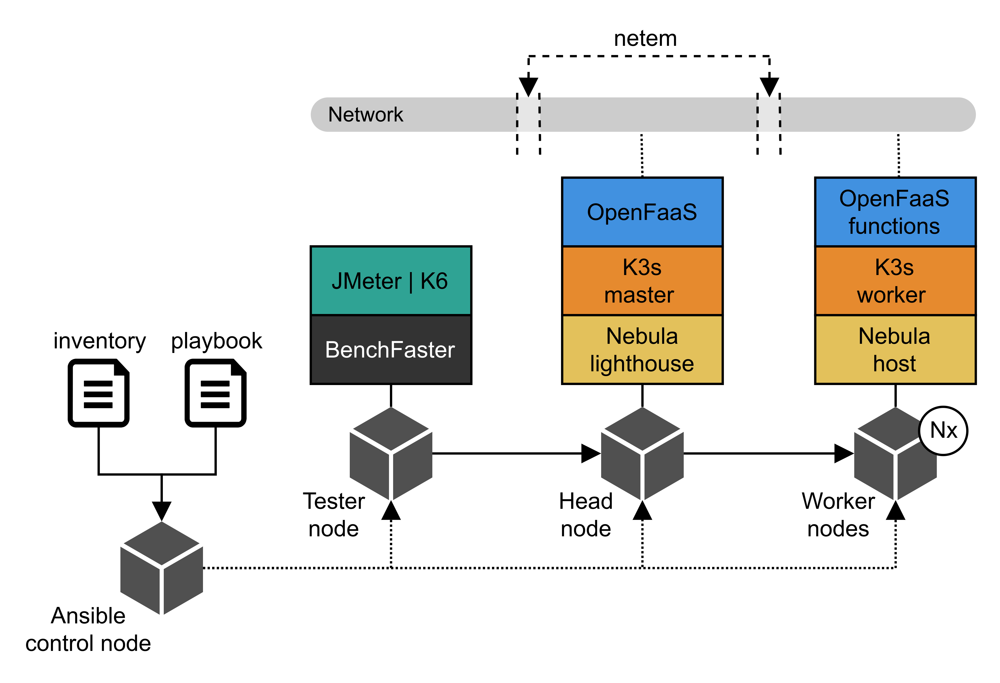

# BenchFaster

BenchFaster automates the deployment and benchmarking of containerized
applications over emulated wide area networks. 


## Overview



BenchFaster consist on four type of nodes:

- Ansible control node: A system from where one or more instances of BenchFaster are
  launched. Components:
  
  - Ansible
  
- Tester node: A remote host from where BenchFaster deployment is launched and the
  benchmarks are run. Components:

  - BenchFaster
  - Load testing tool: JMeter, k6

- Head node: A remote host where all the core components of BenchFaster are
  deployed. Components: 

  - Container orchestrator: K3s (master)
  - Serverless framework: OpenFaaS
  - Overlay network (discovery server): Nebula lighthouse

- Worker node: A remote host where serverless functions are deployed.
  Components: 

  - Container orchestrator: K3s (worker node)
  - Serverless functions: OpenFaaS functions ([examples](https://github.com/fcarp10/openfaas-functions))
  - Overlay network (client): Nebula host


## Prerequisites

- Ubuntu Server 22.04 or Arch Linux in all nodes
- `ansible` installed in the control node (check Ansible node [requirements](https://docs.ansible.com/ansible/latest/installation_guide/intro_installation.html#node-requirement-summary))
- Passwordless sudo access in all nodes
- SSH key-based authentication from control node to all other nodes
- Raspberry Pis with Ubuntu Server, please check [K3s docs](https://docs.k3s.io/advanced#raspberry-pi) and enable `systemd-timesyncd.service`
- (Optional) Local container [registry](https://docs.docker.com/registry/deploying/)
- ssh-copy-id user@localhost


## Operation modes

Two operation modes are possible in BenchFaster:

- Hosts mode: Head/worker nodes are remote systems.
- Hypervisor mode: Head/worker nodes are deployed on VMs with libvirt/KVM.


## Inventory

Two categories of hosts are expected in the Ansible inventory file: `machines`
and `testers`. 

Common parameters:
- `ansible_host`: Name of the host to connect from the ansible control node
- `ansible_user`: User name to connect
- `interface`: Network interface
- `arch`: amd64 or arm64

Machines:
- `headnode`: true, when the machine is the head node

Testers:
- `address_benchmark`: Name of the host where to run the benchmarks against

## Playbook

Playbooks define the following variables:

- `num_workers`: Number of workers in the cluster 
- `vagrant.vm_cpu`: Number of CPUs units per VM (required only in hypervisor mode)
- `vagrant.vm_mem`: Amount of RAM per VM (required only in hypervisor mode)
- `vagrant.vm_image`: Name of the Vagrant box (required only in hypervisor mode)
- `nebula.nebula_version`: Nebula version
- `nebula.nebula_address`: Nebula address
- `nebula.nebula_port`: Nebula port
- `k3s.k3s_version`: K3s version
- `k3s.k3s_port`: K3s port
- `openfaas.openfaas_version`: OpenFaaS version
- `openfaas.openfaas_port`: OpenFaaS port 
- `openfaas.openfaas_namespace`: OpenFaaS namespace for functions
- `openfaas.openfaas_functions`: List of OpenFaaS functions to deploy
- `netem.delay_intra`: Intra node delay in ms
- `netem.variance_intra`: Intra node delay variance in ms
- `netem.loss_intra`: Intra node loss probability in %
- `netem.delay_tm`: From tester to head node delay in ms
- `netem.variance_tm`: From tester to head node variance in ms
- `netem.loss_tm`: From tester to head node loss probability in %


## Install Requirements

Install the requirements for each type of node with:

```shell
ansible-playbook -i inventory/inventory_example.yml requirements/${REQ_FILE}.yml
```
where `REQ_FILE` is either `machine`, `tester` or `hypervisor`.

## Deploy local container registry

Deploy local container registry on the tester node:
```shell
ansible-playbook -i inventory/inventory_example.yml playbook_registry.yml
```

## Run hello-world test

Run a hello-world example with:

```shell
ansible-playbook -i inventory/inventory_example.yml playbook_example.yml
```

Optional variables (`-e "key=value"`):
  - `hvm=true`: When using a hypervisor
  - `repetitions=N`: Number of repetitions of a certain workflow

