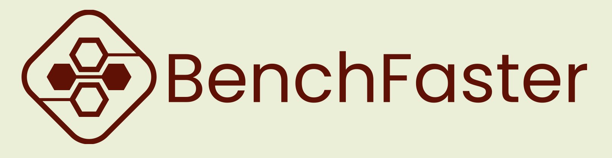

<!-- Thanks to https://github.com/othneildrew/Best-README-Template for the Best-README-Template-->
<a name="readme-top"></a>

<!-- [![Contributors][contributors-shield]][contributors-url]
[![Forks][forks-shield]][forks-url]
[![Stargazers][stars-shield]][stars-url]
[![Issues][issues-shield]][issues-url]
[![MIT License][license-shield]][license-url] -->


<!-- PROJECT LOGO -->
<br />
<div align="center">
  <a href="https://github.com/fcarp10/benchfaster">
    
  </a>

<!-- <h3 align="center">BenchFaster</h3> -->

  <p align="center">
    Automating the deployment and benchmarking of containerized
apps over emulated WANs
    <br />
    <a href="https://github.com/fcarp10/benchfaster"><strong>Explore the docs »</strong></a>
    <br />
    <br />
    <a href="https://github.com/fcarp10/benchfaster/issues">Report Bug</a>
    ·
    <a href="https://github.com/fcarp10/benchfaster/issues">Request Feature</a>
  </p>
</div>


<!-- TABLE OF CONTENTS -->
<details>
  <summary>Table of Contents</summary>
  <ol>
    <li>
      <a href="#about-the-project">About The Project</a>
      <!-- <ul>
        <li><a href="#built-with">Built With</a></li>
      </ul> -->
    </li>
    <li>
      <a href="#getting-started">Getting Started</a>
      <ul>
        <li><a href="#prerequisites">Prerequisites</a></li>
        <li><a href="#installation">Installation</a></li>
      </ul>
    </li>
    <li><a href="#usage">Usage</a></li>
    <ul>
        <li><a href="#inventory-files">Inventory files</a></li>
        <li><a href="#local-registry">Local registry</a></li>
        <li><a href="#playbooks">Playbooks</a></li>
    </ul>
    <!-- <li><a href="#roadmap">Roadmap</a></li> -->
    <!-- <li><a href="#contributing">Contributing</a></li> -->
    <li><a href="#license">License</a></li>
    <!-- <li><a href="#contact">Contact</a></li> -->
    <!-- <li><a href="#acknowledgments">Acknowledgments</a></li> -->
  </ol>
</details>


<!-- ABOUT THE PROJECT -->
## About The Project

[![Product Name Screen Shot][product-screenshot]](https://example.com)

**Ansible control node**: A system from where one or more instances of BenchFaster are
  launched using Ansible.

**Tester node**: A remote host from where BenchFaster deployment is launched and the
  benchmarks are run.

**Head node**: A remote host where all the core components of BenchFaster are
deployed.

**Worker node**: A remote host where containerized tools are deployed.

### Built With

#### Core components

[![Ansible][ansible]][ansible-url] [![K3s][k3s]][k3s-url] [![Nebula][nebula]][nebula-url] [![Netem][netem]][netem-url] [![Vagrant][vagrant]][vagrant-url] 

#### Benchmarking tools
[![JMeter][jmeter]][jmeter-url] [![k6][k6]][k6-url] [![hey][hey]][hey-url] 

#### Applications
[![knative][knative]][knative-url] [![OpenFaas][openfaas]][openfaas-url] [![Mosquitto][mosquitto]][mosquitto-url] [![RabbitMQ][rabbitmq]][rabbitmq-url] 


<p align="right">(<a href="#readme-top">back to top</a>)</p>


<!-- GETTING STARTED -->
## Getting Started

<!-- TO-DO -->

### Prerequisites

Minimum prerequisites before installing dependencies are:

- `ansible` in the control node ([requirements](https://docs.ansible.com/ansible/latest/installation_guide/intro_installation.html#node-requirement-summary))
- Ubuntu Server 22.04 or Arch Linux (all machines)
- Passwordless sudo access (all machines)

### Installation

1. Clone the repo
   ```sh
   git clone https://github.com/fcarp10/benchfaster.git
   cd benchfaster/
   ```

2. Related dependencies and configuration can be installed using the provided playbooks. Install requirements for each type of node with

    ```shell
    ansible-playbook -i inventory/inventory_example.yml requirements/${REQ_FILE}.yml
    ```
    where `REQ_FILE` is either `machine`, `tester` or `hypervisor`.


<p align="right">(<a href="#readme-top">back to top</a>)</p>


<!-- USAGE EXAMPLES -->
## Usage

<!-- TO-DO -->

### Inventory files

Two main categories of hosts are expected in the Ansible inventory file: `machines`
and `testers`. 

Common parameters
- `ansible_host`: Name of the host to connect from the ansible control node
- `ansible_user`: User name to connect
- `interface`: Network interface
- `arch`: amd64 or arm64

Machines
- `headnode`: true, when the machine is the head node

Testers
- `address_benchmark`: Name of the host where to run the benchmarks against

See an example of an inventory file [here](inventory/inventory_example.yml).

Benchfaster can also automate the deployment of VMs using vagrant with
libvirt/KVM. In that case, it is expected a `hypervisors` category in the
inventory file.

Hypervisors
- `vagrant.num_workers`: Number of workers (VMs) in the cluster
- `vagrant.image`: Vagrant box ([search](https://app.vagrantup.com/boxes/search))
- `vagrant.memory`: RAM per VM 
- `vagrant.cpu`: CPUs per VM

See an example of an inventory file with Hypervisors [here](inventory/inventory_hypervisor_example.yml).


### Local registry

Deploying a local container registry is optional, but recommended
```shell
ansible-playbook -i inventory/inventory_example.yml local_registry.yml
```

### Playbooks

Run playbooks

```shell
ansible-playbook -i inventory/inventory_example.yml ${PLAYBOOK_FILE}.yml
```


<p align="right">(<a href="#readme-top">back to top</a>)</p>


<!-- ROADMAP -->
<!-- ## Roadmap

- [ ] Feature 1
- [ ] Feature 2
- [ ] Feature 3
    - [ ] Nested Feature

See the [open issues](https://github.com/fcarp10/benchfaster/issues) for a full list of proposed features (and known issues).

<p align="right">(<a href="#readme-top">back to top</a>)</p> -->


<!-- CONTRIBUTING -->
<!-- ## Contributing

Contributions are what make the open source community such an amazing place to learn, inspire, and create. Any contributions you make are **greatly appreciated**.

If you have a suggestion that would make this better, please fork the repo and create a pull request. You can also simply open an issue with the tag "enhancement".
Don't forget to give the project a star! Thanks again!

1. Fork the Project
2. Create your Feature Branch (`git checkout -b feature/AmazingFeature`)
3. Commit your Changes (`git commit -m 'Add some AmazingFeature'`)
4. Push to the Branch (`git push origin feature/AmazingFeature`)
5. Open a Pull Request

<p align="right">(<a href="#readme-top">back to top</a>)</p> -->


<!-- LICENSE -->
## License

Distributed under the MIT License. See `LICENSE.txt` for more information.

<p align="right">(<a href="#readme-top">back to top</a>)</p>


<!-- CONTACT -->
<!-- ## Contact

Your Name - email@email_client.com

Project Link: [https://github.com/fcarp10/benchfaster](https://github.com/fcarp10/benchfaster)

<p align="right">(<a href="#readme-top">back to top</a>)</p> -->


<!-- ACKNOWLEDGMENTS -->
<!-- ## Acknowledgments

* []()
* []()
* []() -->

<!-- <p align="right">(<a href="#readme-top">back to top</a>)</p> -->


<!-- MARKDOWN LINKS & IMAGES -->
<!-- https://www.markdownguide.org/basic-syntax/#reference-style-links -->
[contributors-shield]: https://img.shields.io/github/contributors/fcarp10/benchfaster.svg?style=for-the-badge
[contributors-url]: https://github.com/fcarp10/benchfaster/graphs/contributors
[forks-shield]: https://img.shields.io/github/forks/fcarp10/benchfaster.svg?style=for-the-badge
[forks-url]: https://github.com/fcarp10/benchfaster/network/members
[stars-shield]: https://img.shields.io/github/stars/fcarp10/benchfaster.svg?style=for-the-badge
[stars-url]: https://github.com/fcarp10/benchfaster/stargazers
[issues-shield]: https://img.shields.io/github/issues/fcarp10/benchfaster.svg?style=for-the-badge
[issues-url]: https://github.com/fcarp10/benchfaster/issues
[license-shield]: https://img.shields.io/github/license/fcarp10/benchfaster.svg?style=for-the-badge
[license-url]: https://github.com/fcarp10/benchfaster/blob/master/LICENSE.txt

[product-screenshot]: _img/stack.png
[ansible]: https://img.shields.io/badge/Ansible-E00?logo=ansible&logoColor=fff&style=for-the-badge
[ansible-url]: https://docs.ansible.com/
[k3s]: https://img.shields.io/badge/K3s-FFC61C?logo=k3s&logoColor=000&style=for-the-badge
[k3s-url]: https://k3s.io/
[nebula]: https://img.shields.io/badge/nebula-714431?style=for-the-badge
[nebula-url]: https://github.com/slackhq/nebula
[netem]: https://img.shields.io/badge/netem-445982?style=for-the-badge
[netem-url]: https://man7.org/linux/man-pages/man8/tc-netem.8.html
[vagrant]: https://img.shields.io/badge/Vagrant-1868F2?logo=vagrant&logoColor=fff&style=for-the-badge
[vagrant-url]: https://www.vagrantup.com/
[jmeter]: https://img.shields.io/badge/Apache%20JMeter-D22128?logo=apachejmeter&logoColor=fff&style=for-the-badge
[jmeter-url]: https://jmeter.apache.org/
[k6]: https://img.shields.io/badge/k6-7D64FF?logo=k6&logoColor=fff&style=for-the-badge
[k6-url]: https://k6.io
[hey]: https://img.shields.io/badge/hey-EEACB0?style=for-the-badge
[hey-url]: https://github.com/rakyll/hey
[knative]: https://img.shields.io/badge/Knative-0865AD?logo=knative&logoColor=fff&style=for-the-badge
[knative-url]: https://knative.dev/docs/
[openfaas]: https://img.shields.io/badge/OpenFaaS-3B5EE9?logo=openfaas&logoColor=fff&style=for-the-badge
[openfaas-url]: https://www.openfaas.com/
[mosquitto]: https://img.shields.io/badge/Eclipse%20Mosquitto-3C5280?logo=eclipsemosquitto&logoColor=fff&style=for-the-badge
[mosquitto-url]: https://mosquitto.org/
[rabbitmq]: https://img.shields.io/badge/RabbitMQ-F60?logo=rabbitmq&logoColor=fff&style=for-the-badge
[rabbitmq-url]: https://www.rabbitmq.com/
